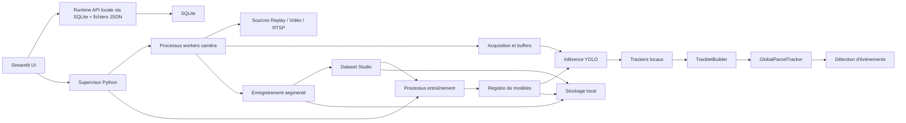
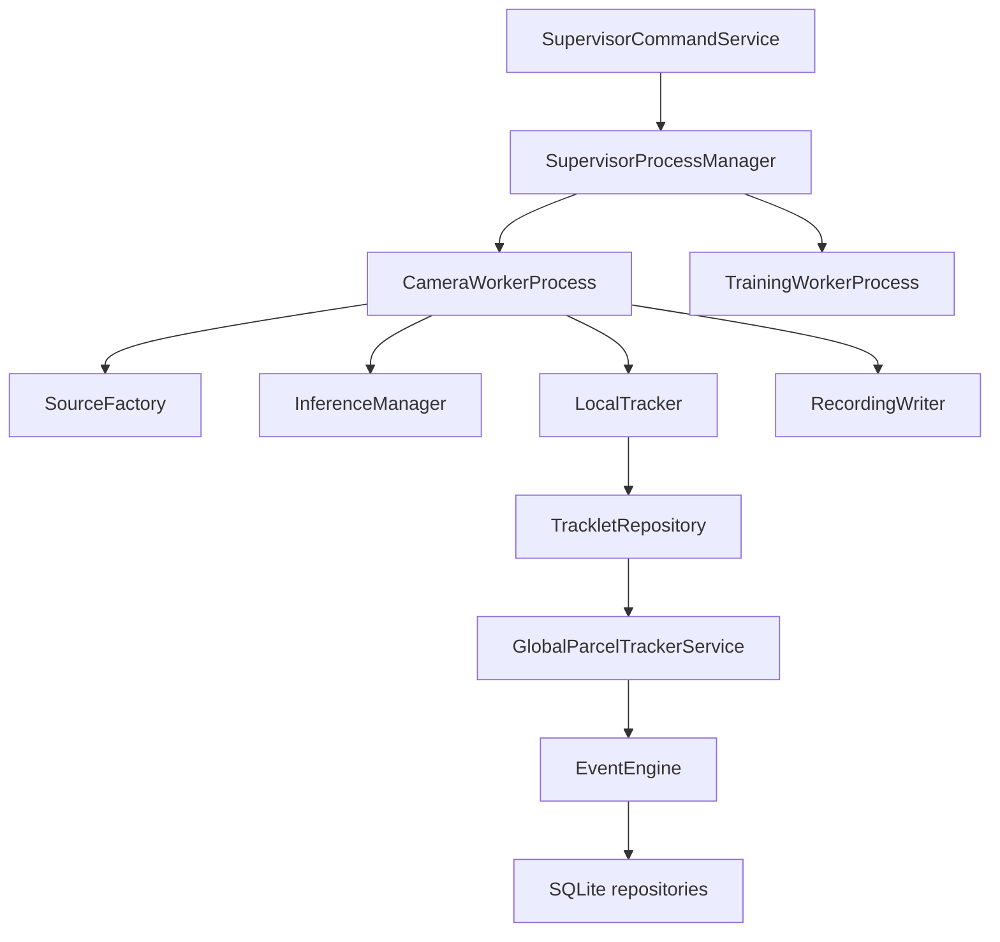
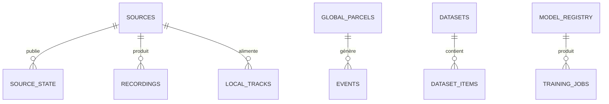

## 1. Conception d'architecture


## 2. Description technologique
- Interface : Streamlit
- Runtime : Python 3.12, multiprocessing, threading ciblé pour IO local, subprocess pour entraînement si nécessaire
- Vision : Ultralytics YOLO, OpenCV, NumPy
- Données : SQLite, fichiers YAML/JSON, stockage local segmenté
- Tests : pytest
- Journalisation : logging structuré JSON lines orienté processus

## 3. Définition des routes UI
| Route logique | Usage |
|---------------|-------|
| `app.py` | Entrée Streamlit avec navigation Dashboard |
| `ui/pages/cameras.py` | Gestion des sources |
| `ui/pages/live_tracking.py` | Suivi temps réel et previews |
| `ui/pages/recordings.py` | Segments et historique |
| `ui/pages/dataset_studio.py` | Création et export dataset |
| `ui/pages/training.py` | Lancement et suivi d'entraînement |
| `ui/pages/models.py` | Registre des modèles |
| `ui/pages/events.py` | Journal d'événements |
| `ui/pages/settings.py` | Paramètres globaux |

## 4. Interfaces internes
### 4.1 Contrats coeur
```python
class FrameSource(Protocol):
    def open(self) -> None: ...
    def read(self) -> Frame | None: ...
    def close(self) -> None: ...
```

```python
@dataclass
class Frame:
    camera_id: str
    frame_index: int
    timestamp: float
    image: np.ndarray
```

```python
@dataclass
class Observation:
    class_name: str
    confidence: float
    bbox: tuple[float, float, float, float]
    mask: np.ndarray | None = None
    keypoints: list[tuple[float, float, float]] | None = None
    embedding: list[float] | None = None
```

### 4.2 Tables SQLite principales
| Table | Finalité |
|-------|----------|
| `sources` | Définition des sources caméra et rôle C1/C2/C3 |
| `source_state` | État courant, FPS, erreurs, timestamps |
| `frames_latest` | Référence de la dernière frame et preview sérialisée |
| `local_tracks` | Tracks locaux par caméra |
| `global_parcels` | Colis globaux et état métier |
| `events` | Journal d'événements métier et techniques |
| `recordings` | Segments vidéo et métadonnées |
| `datasets` | Registre des datasets |
| `dataset_items` | Échantillons et statut de revue |
| `training_jobs` | Suivi des exécutions d'entraînement |
| `model_registry` | Modèles disponibles et statut de promotion |
| `job_runs` | Jobs runtime pilotés par le supervisor |
| `site_config` | Topologie, zones, délais, paramètres globaux |

## 5. Diagramme d'architecture serveur locale


## 6. Modèle de données
### 6.1 ER simplifié


### 6.2 DDL initiale
```sql
CREATE TABLE IF NOT EXISTS sources (
  id TEXT PRIMARY KEY,
  name TEXT NOT NULL,
  role TEXT NOT NULL,
  source_type TEXT NOT NULL,
  uri TEXT NOT NULL,
  model_name TEXT NOT NULL,
  tracker_name TEXT NOT NULL,
  enabled INTEGER NOT NULL DEFAULT 1,
  created_at TEXT NOT NULL,
  updated_at TEXT NOT NULL
);

CREATE TABLE IF NOT EXISTS source_state (
  source_id TEXT PRIMARY KEY,
  status TEXT NOT NULL,
  fps REAL NOT NULL DEFAULT 0,
  last_error TEXT,
  last_frame_ts REAL,
  updated_at TEXT NOT NULL
);

CREATE TABLE IF NOT EXISTS events (
  id TEXT PRIMARY KEY,
  event_type TEXT NOT NULL,
  parcel_id TEXT,
  camera_id TEXT,
  payload_json TEXT NOT NULL,
  created_at TEXT NOT NULL
);
```

## 7. Décisions d'implémentation
- Les traitements doivent survivre aux rechargements Streamlit car ils tournent sous `visionsort.runtime.supervisor`.
- Le mode démonstration repose sur des sources Replay synthétiques si aucune vidéo n'est fournie.
- Les appels YOLO réels sont encapsulés et disposent d'un repli simulé si Ultralytics n'est pas disponible ou si aucun poids dédié n'est présent.
- Les associations multicaméras restent prudentes : un score ambigu produit `AMBIGUOUS`, jamais une fusion forcée.
- Les jobs d'entraînement sont isolés, journalisés et tolèrent les erreurs CUDA OOM avec statut explicite.
