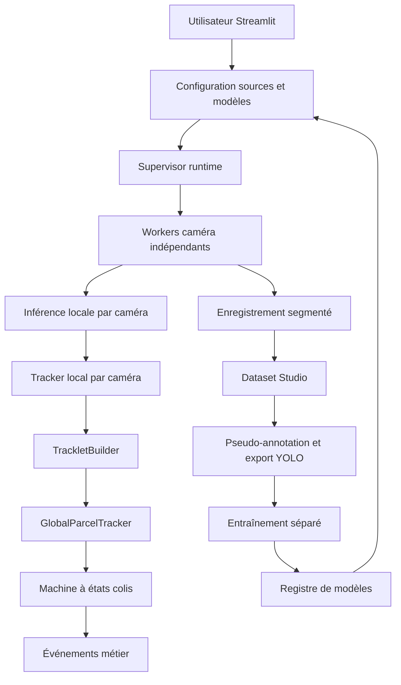

## 1. Vue d'ensemble produit
VisionSort est une application locale de vision industrielle pour le suivi de colis sur convoyeurs gravitaires avec 2 ou 3 caméras, en mode Replay aujourd'hui et RTSP demain sans changer l'architecture.
- Elle sert à configurer des sources, lancer des traitements persistants, suivre les colis entre caméras, détecter prise/transport/dépôt et constituer un cycle d'amélioration continue via dataset et entraînement.
- La cible est un ingénieur vision, méthodes ou industrialisation qui veut un outil opérable localement, sans dépendances cloud obligatoires, avec SQLite et Streamlit.

## 2. Fonctionnalités coeur
### 2.1 Rôles utilisateur
| Rôle | Mode d'accès | Permissions coeur |
|------|--------------|-------------------|
| Opérateur technique local | Exécution locale | Configurer sources, démarrer/arrêter jobs, consulter événements, gérer datasets et modèles |

### 2.2 Modules fonctionnels
1. **Dashboard** : statut global, jobs, alertes, GPU, compteurs clés.
2. **Cameras** : déclaration de sources Replay/vidéo/RTSP, rôle C1/C2/C3, test de connexion, configuration tracker et modèle.
3. **Live Tracking** : previews annotées, tracks locaux, colis globaux, handoffs, états colis, métriques temps réel.
4. **Recordings** : segments enregistrés, métadonnées, relance dataset, contrôle de conservation.
5. **Dataset Studio** : extraction d'images, sélection d'échantillons difficiles, pseudo-annotation, export YOLO et revue.
6. **Training** : lancement de recettes YOLO, suivi d'exécution, logs, métriques, artefacts, comparaison.
7. **Models** : registre local, champion/candidate, activation, rollback, disponibilité par tâche.
8. **Events** : événements métier et techniques, filtres, ambiguïtés, mauvais dépôts, historique.
9. **Settings** : topologie du site, zones, délais de transit, stockage, paramètres runtime.

### 2.3 Détail des pages
| Nom de page | Module | Description |
|-------------|--------|-------------|
| Dashboard | Santé système | Statut du supervisor, jobs actifs, base, stockage, GPU, alertes |
| Dashboard | Synthèse métier | Entrées, sorties, pertes, handoffs, picks, drops, ambiguïtés |
| Cameras | Registre des sources | Ajouter source Replay, fichier vidéo ou RTSP, rôle caméra, test de lecture |
| Cameras | Commandes | Démarrer, arrêter, enregistrer, changer tracker, choisir modèle |
| Live Tracking | Mur de previews | Dernière frame annotée par caméra avec overlays |
| Live Tracking | Suivi multicaméra | Table colis globaux, états, correspondances et résultats MATCHED/AMBIGUOUS/UNMATCHED |
| Recordings | Segments vidéo | Liste des segments, durée, source, chemin relatif, statut |
| Dataset Studio | Sélection intelligente | Faibles confiances, chevauchements, pertes, handoffs ambigus, picks/drops incertains |
| Dataset Studio | Export | Génération train/val/test, labels YOLO, data.yaml, manifest.csv |
| Training | Recettes | Choix dataset, tâche, architecture, checkpoint, imgsz, epochs, batch, device, patience |
| Training | Suivi | Progression, logs, métriques, erreurs CUDA OOM, artefacts |
| Models | Registre | Version, type, métriques, statut CANDIDATE/CHAMPION/REJECTED/ARCHIVED |
| Models | Activation | Sélection du modèle actif et rollback |
| Events | Journal | Événements parcel_picked, parcel_carried, parcel_dropped, wrong_destination, ambiguïtés |
| Settings | Topologie | Délais inter-caméras, zones d'entrée/sortie/destination, stockage et rétention |

## 3. Processus coeur
Flux principal :
1. L'utilisateur crée des sources C1/C2/C3 en mode Replay ou RTSP.
2. Le supervisor lance des processus indépendants persistants pour acquisition, inférence, tracking et enregistrement.
3. Chaque caméra publie un état, une dernière frame annotée, des tracks locaux et des segments d'enregistrement.
4. Le moteur multicaméra construit des tracklets et des colis globaux sans forcer les associations ambiguës.
5. La machine à états colis déduit prise, transport, dépôt et erreurs de destination.
6. Les enregistrements et observations servent à créer des datasets, lancer des entraînements et promouvoir les meilleurs modèles.

## 4. Interface utilisateur
### 4.1 Style visuel
- Direction visuelle : interface industrielle sombre, lisible, orientée salle de contrôle.
- Couleurs : anthracite, bleu acier, cyan de signalisation, ambre pour alertes, vert pour état nominal.
- Boutons : angles modérés, contraste fort, états actifs/inactifs explicites.
- Typographie : une police technique pour les titres et une police très lisible pour tableaux et métriques.
- Mise en page : desktop-first, cartes denses, barres latérales et panneaux d'inspection.
- Icônes : sobres, inspirées supervision/automatisme.

### 4.2 Vue d'ensemble par page
| Nom de page | Module | Éléments UI |
|-------------|--------|-------------|
| Dashboard | Cartes système | KPI, badges d'état, jauges, tables d'alertes |
| Cameras | Formulaire source | Champs type, URI/chemin, rôle, modèle, tracker, test connexion |
| Live Tracking | Panneaux vidéo | Image annotée, FPS, latence, statut source, événements récents |
| Dataset Studio | Outils QA | Filtres par difficulté, compteurs de statuts, export guidé |
| Training | Console | Journal, métriques, sélection de recette, artefacts |

### 4.3 Responsivité
- Priorité bureau, avec adaptation tablette simple.
- Les vues critiques restent utilisables sur écran moyen avec colonnes repliables.
- Les listes longues utilisent des conteneurs scrollables internes.
